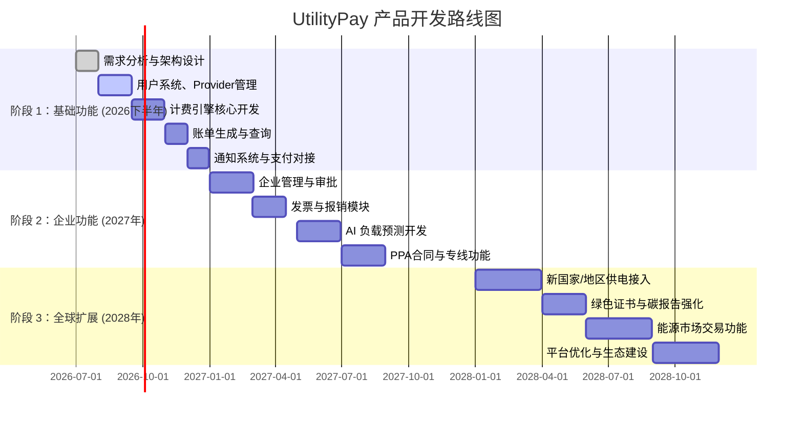

# 执行摘要  
**UtilityPay** 是一款面向全球水、电（未来扩展可燃气、取暖等）缴费与能源交易管理的开源SaaS平台，强调**开源、可私有化部署与合规性**。它位于公共事业企业与终端用户/企业客户之间，提供对接上游供水电公司、配置多种计费规则、精准计算账单、灵活通知和汇总预警、以及支付聚合等功能。通过AI预测模块和新能源支持模块（如数据中心专线、直接购电PPA、微电网管理、碳排放追踪等），UtilityPay 不仅满足传统民用/企事业缴费需求，也面向未来的AI算力、云计算等大规模用电场景。  

平台支持中国、欧洲、美洲、澳洲等主要地区，并兼容当地主流公共事业企业与支付渠道，实现**上下游配置简单、用户体验友好、计费精确透明**。在保障用户隐私的前提下，UtilityPay 同时兼顾企业财务审批、发票报销等需求，以及环保合规（如碳足迹计算、绿色电力证书管理）和多语言多货币。项目将遵循Apache 2.0许可发布，提供详实文档和插件体系，便于全球开发者扩展。  

主要指标包括：支持100+上游企业接入、20+支付方式、99.9% 平台可用性、账单计算准确率、环保数据统计精度等。下文详细说明产品定位、用户与角色、业务流程、功能需求（包括上游接入、计费、账单、通知、支付、发票报销、审批流程、AI预测、AI数据中心专线/PPA、B2B结算、微电网/储能、碳追踪与可再生能源证书、能源市场与交易等）、合规隐私要求、国际化、多币种、多语言、部署与许可、插件和API设计、非功能需求、KPI、开发路线及风险缓解等。

# 1. 产品定位与愿景  
- **定位**：全球公共事业（供水/供电/燃气等）账单管理与支付中间平台 + 未来能源交易基础设施。  
- **愿景**：打造开放、可配置的**Utility Billing & Settlement Infrastructure**，类似于公共事业领域的“Stripe+SAP Connector”，连接**上游电力/水务公司**与**下游用户/企业**，并扩展至**AI数据中心能源管理**与**清洁能源交易**领域。  
- **核心竞争力**：可编程计费引擎、全球Provider插件、支付聚合层、企业财务合规支持、碳跟踪与绿电管理、私有化部署能力、开源生态扩展。  

# 2. 目标用户与角色  

- **终端用户（居民/员工）**：个人或家庭用户。功能需求包括查看/下载账单与发票、设置用电/用水通知、在线支付、用量/费用预测、隐私与数据管理（符合GDPR/PIPL等）。  
- **企业用户（企事业单位）**：公司或组织账户。需求包括多账号管理、用量归集、部门分摊、成本中心、审批流程、发票与报销、一体化会计入账等。  
- **公共事业企业（Utility Provider）**：上游供电、供水、燃气等企业。能力包括用户数据对接、账单上传/同步、计费规则配置、渠道管理、收款统计、合规报表输出等。典型包括国家/地区的电网公司、水务局、独立发电企业、新能源供应商等。  
- **AI数据中心/云计算企业**：作为特殊下游客户，大规模电力采购者，需求包括数据中心专线接入、长期PPA合同管理、峰谷/动态调度、电力质量监控、企业级结算。  
- **平台管理员**：系统运维与配置人员。负责平台部署、权限管理、插件和扩展管理、数据隔离、多租户配置等。  

# 3. 业务流程概览  
业务流程大体如下：  

1. **上游接入：** 供水/供电企业通过API、文件或数据库同步等方式接入平台，并建立对应的 Provider 配置。  
2. **计费规则配置：** Utility Provider 在平台上配置水电费率（阶梯价、峰谷价、季节价、合同价等）和税费规则。  
3. **数据获取：** 平台定期从上游获取用户用量或账单数据；也支持智能电表、远程读数等接入。  
4. **账单生成：** 使用计费引擎计算每个用户的当期账单，生成账单记录和发票。  
5. **通知与预测：** 用户可配置多种渠道（邮件、短信、App推送、微信/WhatsApp/Slack消息等）接收新账单、用量预警、缴费提醒。同时，系统基于历史用量和环境因素进行当月用量/费用预测（AI预测模型）。  
6. **在线支付：** 平台聚合多种支付方式（详见下表），用户/企业可直接在线支付或自动扣款。支持个人钱包/扫码支付，也支持企业银行转账、ACH/SEPA 等。  
7. **发票与报销：** 支持生成符合各地区要求的电子发票/增值税发票/VAT发票等，并与企业ERP对接，实现自动报销。  
8. **碳与绿电管理：** 平台记录用电来源，计算碳足迹，支持绿色电力证书（GEC/REC）管理与配额跟踪；可提供碳排放报告。  
9. **AI数据中心专项流程：** 支持大客户专线配置与监控、PPA合同执行和结算、能耗预测与调度。  
10. **结算与财务：** 企业端账单汇总可导出用于财务审计，多级审批后发起银行支付或ERP付款。平台记录完整审计日志，满足合规需求。  

# 4. 功能需求  

## 4.1 上游 Provider 接入管理  
- **Provider 配置：** 支持添加不同国家和地区的公用事业单位（供电、电网、水务、燃气等）条目，记录名称、类型（电/水/燃气/热力）、国家/区域、API地址/认证方式、账单数据格式（JSON/XML/CSV/EDI）等。  
- **接入方式：**  
  - *API*：支持 RESTful API、GraphQL、SOAP 等多种接口，可双向同步用户和账单数据。  
  - *文件*：支持定时获取上传 CSV/Excel/XML/EDI 等格式文件。  
  - *数据库连接*：支持通过 JDBC 等方式直接与上游数据库同步（如MySQL、Oracle）。  
- **典型接入单位：** 举例包括中国国家电网、南方电网，各省市电力公司；欧洲如EDF（法国）、Enel（意大利）、RWE/ENBW（德国）、Iberdrola（西班牙）等；美洲如PG&E（美国）、Eletrobras（巴西）等；澳洲如AGL、Origin Energy 等。也包括新型供应商：小型光伏/风电厂、储能运营商、地区能源公司等。  

## 4.2 计费引擎 Billing Engine  
**目标：** 费用计算高度可配置，精准反映各地电价政策和合同条款。  

- **计费规则类型**（支持表）：

| 类型     | 描述                                     | 示例                                                         |
|--------|----------------------------------------|------------------------------------------------------------|
| 阶梯价    | 根据累进用量分档定价                           | 0–100 kWh: 0.5元/kWh；100–300 kWh: 0.6元/kWh；>300 kWh: 0.8元/kWh。 |
| 峰谷时段价  | 不同时段不同电价（峰时、平时、谷时）               | 峰时（8:00–22:00）1.2元/kWh，谷时（22:00–8:00）0.6元/kWh。                |
| 季节电价   | 夏季/冬季或需求旺季/淡季差价                     | 夏季加价0.1元/kWh；冬季优惠0.05元/kWh。                         |
| 动态价    | 实时/日内电网市场价格、负荷调节电价等               | 对接电力市场API，实时获取价格并计算成本（用GPU训练时段价格）。            |
| 合同价    | 长期购电协议 (PPA) 固定价                       | 双方签订每年200 MWh/月，价格0.6 USD/kWh，含最低购电量约定。               |
| 需求电费   | 对大用电企业按峰值需量计费                     | 每月最大需量按 $10/kW$计费（适用于企业用电）。                         |
| 税费/附加费 | 增值税、环保附加费、可再生能源附加费等               | VAT 13%，或固定服务费每月5元。                                       |
| 自定义脚本  | 可编写DSL或脚本实现复杂逻辑                       | 例如：`if usage<=100: price=usage*0.5; else: price=50+(usage-100)*0.8`。 |

- **配置方式**：平台提供可视化编辑界面和导入模板，支持条件式逻辑或公式定义，满足不同地区用电收费规则。  

## 4.3 账单管理  
- **账单记录**：每个用户/账户建立账单模型，字段包括：账单ID、用户/企业、Provider、计费周期、表号、用量、单价、税费、总金额、状态等。  
- **账单状态**：如“已生成”、“未付款”、“已支付”、“逾期”、“已取消”。支持手动/自动标记逾期和罚金计算。  
- **历史数据**：存储并允许查询历史账单和用量趋势，导出CSV/PDF报告。  
- **异常检测**：可设置阈值或AI监控，发现异常高耗或计费逻辑错误时标记并通知管理员或用户。  

## 4.4 通知中心 Notification Center  
- **多渠道推送**：支持多种通知方式，用户自由选取组合。包括：  
  - **邮件**（Email）、**短信**（SMS）、**移动App推送**  
  - **即时通讯**：国内微信（小程序/订阅消息）、钉钉；国际版WhatsApp、Telegram、Line等。  
  - **企业协作**：Slack、Microsoft Teams 通知。  
  - **系统内通知**：Web门户消息中心、App内收件箱。  
- **通知规则**：用户可配置触发条件，如账单生成、余额不足、缴费截止临近、用量异常等。例如：  
  - 账单生成后**立即通知**。  
  - 预存余额低于20%时**自动提醒**。  
  - 截止日7天前发出缴费提醒。  
- **内容定制**：支持模板语言，可自定义消息文案（包括多语言版本）、添加账单明细或附图。  

## 4.5 支付聚合平台  
- **支付渠道支持**：通过统一支付接口集成全球主流和本地支付方式，参考如下：  

| 地区          | 主流支付方式                                                         |
|-------------|---------------------------------------------------------------------|
| **中国**      | 支付宝、微信支付、银联卡、网银支付（各大银行网银）、银联云闪付（NFC）等。            |
| **欧洲**      | **信用卡/借记卡**：Visa, Mastercard, American Express； **银行支付**：SEPA Direct Debit（欧元区）、iDEAL（荷兰）、Giropay（德国）、Bancontact（比利时）、EPS（奥地利）、Trustly等； **数字钱包**：Klarna（先买后付）、PayPal、Google Pay、Apple Pay、Twint（瑞士）、Blik（波兰）等。 |
| **美洲**      | **北美**：信用卡（Visa/Mastercard/Amex/Discover）、PayPal、Apple Pay、Google Pay、Venmo、ACH电子清算（美国）、Interac（加拿大银行转账）等。 **拉美**：巴西Pix即时支付、Boleto Bancário（巴西票据）、Elo（巴西卡）、墨西哥OXXO票据等。 |
| **澳洲**      | Visa/Mastercard、Afterpay/Clearpay（先买后付）、BPAY（澳洲账单支付）、PayID（银行即时支付）、EFT/网银、电汇。 |
| **其他地区**   | 日本：JCB、LINE Pay；韩国：KakaoPay；中东：银联卡、KNET（科威特）、Benefit（巴林）；非洲：M-Pesa等。 |

- **支付功能**：支持一次性支付、定期自动扣款（订阅扣费）、用户钱包/预付款管理；支持**分账**（按部门/项目拆分费用）、**退款处理**；企业版支持**线上审批+企业银企直连**（如ERP付款、SWIFT电汇、ACH批量付款）。  
- **支付安全**：符合PCI-DSS要求，加密传输支付数据，敏感信息不落库。  

## 4.6 发票与报销  
- **发票类型**：各地规范的电子发票或纸质发票模板。包括：中国增值税发票（专票/普票）、欧洲VAT发票、美国税务收据（Tax Receipt）、澳洲GST发票等。  
- **自动开票**：账单支付成功后自动生成发票，上传至用户/企业端。支持打印、下载PDF。  
- **报销集成**：企业用户可导出发票数据（含付款凭证）至财务系统或上传ERP，如SAP Concur、用友、金蝶等，加速报销流程。  

## 4.7 企业审批与财务管理  
- **组织结构**：支持**公司-部门-员工**三级结构，配置成本中心、项目编号等。  
- **多账户管理**：企业管理员可管理不同业务线或下属单位账户。  
- **审批流程**：内置可配置审批流，如：部门提交用电申请/支付申请 → 部门经理批准 → 财务复核 → 执行付款。审批记录可审计。  
- **权限控制**：基于角色（能源管理员、财务、审计等）配置不同权限，如账单查询、审批、导出等。  

## 4.8 AI 能耗预测 Engine  
- **目标**：根据历史用量、季节、天气、业务行为等数据预测未来用水/用电需求，辅助预算与节能决策。  
- **数据输入**：历史消费数据（日/周/月粒度）、气象数据（温度、湿度、工况）、工作日/节假日、企业产能计划、事件计划（如大促、研发任务量）等。  
- **预测模型候选**：从简单到复杂的模型可选：移动平均、指数平滑(SES)、ARIMA/SARIMA、Facebook Prophet；机器学习：随机森林、XGBoost；深度学习：LSTM/GRU网络、Transformer等。可支持模型训练平台（Python TensorFlow/PyTorch）输出结果。  
- **输出**：如“本月预计用电**35000 kWh**，费用**7800元**，同比增长**+12%**”，并生成走势图、置信区间等。  

## 4.9 AI 数据中心专线 & PPA 支持  
面向大型**数据中心/云服务商**等超大用户，提供专用能源服务：  
- **专属供电线路**：管理电厂→专用变电站→数据中心的供电链路。记录线路ID、容量、双路冗余、SLA（连续率目标）、电力质量指标（电压波动、频率稳定性、谐波水平、停电次数）等。  
- **长期购电协议 (PPA)**：支持企业与发电商直接签订长期购电合同（如绿色能源PPA），合同条款包括电量承诺、最小供电量、价格公式（固定或梯度）、违约条款等。平台管理合同生命周期：创建、执行、结算与续约。  
- **电力质量监控**：采集专线实时数据，仪表盘显示电压、频率、功率因数等。异常时可自动通知。  
- **峰谷调度**：智能推荐在低谷时段执行大负载任务（如GPU训练），平衡用电成本。  
- **容量预约**：用户可预订一定的保底功率（如**预留100MW**），系统管理已用/剩余容量，预警超额风险和缺额风险。  

## 4.10 B2B 企业结算  
- **公对公支付**：针对企业账户支付，支持银行转账（ACH、Wire Transfer、SWIFT）、SEPA等企业付款方式，以及企业支付网关（ERP Payment、企业网银接口）。  
- **企业API对接**：支持与企业的财务系统/ERP（SAP、Oracle ERP等）对接，实现账单下发、付款结果回传、自动对账。  
- **审批与审计**：账单生成后进入企业内部审批（部门→财务→高层），审批通过后通过企业指定渠道付款。平台记录审计日志，满足合规需求。  
- **大额合约结算**：如大型PPA、电力批发市场结算等，支持电量核对、对账单生成、银行批量支付。  

## 4.11 微电网与储能管理  
- **微电网接入**：支持接入本地可再生能源（光伏、风电）、电池储能、柴油机等，形成微电网系统。管理多能源供给，支持切换主电源（如自发自用优先、余电上网）。  
- **能源调度优化**：根据电价与需求优化微网运行策略，例如：在电价低谷充电、在高峰放电。  
- **成本与收益**：自动计算自发自用比例、上网电量、收益，支持补贴/政策补贴计算。  
- **配电管理**：监控各来源电量、储能状态，进行I/O统计。  

## 4.12 碳追踪与绿色证书 (Carbon & REC/GEC)  
- **实时碳强度**：根据电网负荷和能源结构计算当前电网碳排放因子（kgCO₂/kWh），参考国家发布数据或国际数据库。  
- **绿色电力配比**：支持用户选择“绿色电力”选项，自动匹配已购或证书覆盖的可再生能源占比。  
- **可再生能源证书(REC/GEC)**：集成购买与核销流程：购买可再生电力证书（国内称绿色证书，符合国家能源局要求）。记录证书编号、MWh、来源项目等，与企业消费电量对应。输出Carbon Footprint报告时，可说明已使用的证书数量。  
- **碳足迹报告**：按照**ISO 14067**（产品碳足迹）和相关国家标准（如GB/T 24067-2024）计算企业或产品用电碳排放量。支持市场法（按证书或PPA）、网均法等。兼容国内外减碳政策：如EU规定**非捆绑REC不可冲抵Scope2**（仅支持直连/PPA）。  
- **碳报告导出**：生成符合**ISO 14064-1**（温室气体盘查）、温室气体排放国家标准等要求的报告，便于节能审计和外部披露。  

## 4.13 能源市场与交易  
- **能源交易市场**：未来可选增设电力/水资源交易所接口（如ISO电力市场数据、国家绿证交易所），支持实时竞价及成交结算。  
- **能源供应商与买家**：建立线上**能源市场平台**。供应商（如电厂、社区微网）发布可售电源/绿色电力，购买方（AI数据中心、企事业）发布需求。示例数据格式：  
  - 供应商：可供200MW，0.05USD/kWh，地点Texas，可售期5年。  
  - 买方需求：100MW绿色电力，时长3年。  
- **撮合与合同**：平台撮合交易意向，支持在线协商、签署PPA模板、执行交易。  
- **报价与对账**：生成市场成交记录与结算账单，自动对账并清算。  

# 5. 国际化、多币种与多语言  
- **地区支持**：平台预置适配中国、欧盟国家、美国、加拿大、澳新、日韩等主要经济体，可进一步扩展。  
- **多语言界面**：默认支持简体中文和英文；可扩展德语、法语、西班牙语、日语、韩语等界面与通知语言。  
- **多币种**：支持ISO 4217定义的货币，包括CNY、USD、EUR、GBP、AUD、CAD、JPY等。用户/企业可按本地货币查看账单，后台支持多币种汇率换算。  
- **国际化配置**：依地区自动应用本地计量单位（kWh/m³）、日期/时间格式、地址格式、税制规则等。  

# 6. 合规与隐私要求  
- **数据隐私**：严格遵守全球主要数据保护法规。比如欧盟**GDPR**（通用数据保护条例）、美国加州**CCPA**、中国**个人信息保护法(PIPL)**、加拿大**PIPEDA**、巴西**LGPD**等。用户数据（姓名、联系方式、地址、用户ID等）加密存储，访问有角色权限控制。处理用户时需**最少必要原则**，多余信息及时删除。  
- **数据加密与留存**：敏感数据（如身份证号、支付凭证等）全量加密存储。按照金融/税务规范，支付交易数据保存至少5年（如中国《网络支付办法》要求）；个人信息处理结果记录至少3年。超过留存期后自动删除或匿名化处理。  
- **安全认证**：支持OAuth2/OIDC认证，企业可接入SAML或企业SSO（Azure AD、Google Workspace、LDAP）。多因素认证（MFA）选项。  
- **日志审计**：记录详细的系统操作审计日志（谁何时修改了什么）。保障可追踪性。  
- **碳合规**：遵守**ISO 14064-1/2**（温室气体盘查）、**ISO 14067**（产品碳足迹）等国际标准。支持欧盟**ETS**（排放交易体系）及中国**碳排放交易**法规中对耗能企业的报告义务。对绿证采用国家能源局要求的“全流程闭环”核发和年度核销方案。遵循《温室气体产品碳足迹量化通则》规定的核算方法（视地区可认可合约、可再生证书等工具）。  

# 7. 私有化部署与开源许可  
- **部署方式**：支持Docker容器化、Kubernetes/Helm图表部署、虚拟机或物理机独立部署等。可通过Ansible或Terraform等自动化部署脚本。  
- **运行环境**：建议最低环境如4核CPU、8GB RAM、100GB存储。生产级部署建议使用多节点K8s集群、负载均衡、高可用数据库。  
- **数据库**：推荐PostgreSQL兼容环境，支持主从复制或云服务。  
- **多租户**：可选**多租户模式**（单实例支持多客户隔离）或**专属实例**部署（如大型AI企业独立部署）。专属部署可提供独立数据库、独立密钥与审计空间。  
- **开源许可**：推荐采用**Apache License 2.0**，允许商用、修改和再分发，兼顾社区和企业友好。  

# 8. 插件与扩展体系  
- **Provider 插件**：各类上游对接实现为插件模块。例如：`provider-china-power`、`provider-eu-watex`、`provider-us-utilities`等。每个插件实现接口：`syncUsers()`、`syncBills()`、`queryUsage()`、`payBill()`、`refund()`等。  
- **支付通道插件**：如Stripe、PayPal、Adyen、Alipay、WeChat Pay等，每个支付方式封装为可选插件，实现统一支付接口。  
- **通知插件**：短信（Twilio、国内运营商SMS）、邮件（SMTP/SendGrid）、微信消息、Push服务等。  
- **自定义扩展**：支持用户开发自定义插件（如特定地区电价规则、特殊接口协议），使用开源SDK接入核心平台。  

# 9. API 接口与数据库概要  
## API 设计（示例）：  
- **用户接口**：`GET /api/v1/bills`（查看账单列表）；`GET /api/v1/bills/{id}`；`POST /api/v1/payment`（发起支付）；`GET /api/v1/forecast`（获取用量/费用预测）等。  
- **企业接口**：`POST /api/v1/provider/bills/upload`（上传账单数据）；`GET /api/v1/provider/users`（查询对接用户）；`POST /api/v1/provider/rules`（配置计费规则）等。  
- **管理接口**：`POST /api/v1/admin/providers`（新增供电企业）；`GET /api/v1/admin/payments/channels`（查询已集成支付方式）；`GET /api/v1/admin/audit/logs`（日志查询）等。  

## 数据库概要：  
- **User**（终端用户表）：`id, name, contact, email, phone, address, meter_id, preferences`。  
- **Provider**（供电企业表）：`id, name, country, type (电/水…), config (API URL, 认证) `。  
- **Meter**：`id, provider_id, meter_number, location, type (电表/水表), associated_user_id`。  
- **Consumption/Usage**：`id, meter_id, timestamp, consumption_value, unit`（如kWh或m³）。  
- **Bill**：`id, user_id, provider_id, billing_period_start, billing_period_end, consumption, unit_price, tax, total_amount, status`。  
- **Payment**：`id, bill_id, amount, method, status, timestamp`。  
- **Invoice**：`id, bill_id, invoice_number, tax_amount, download_link`。  
- **Contract/PPA**：`id, buyer_id, seller_id, power_amount, price, start_date, end_date, status`。  
- **CarbonRecord**：记录电力消耗对应的碳排放量、使用的绿证量等。  

# 10. 国际化支持  
- **跨地区供电企业**：支持中国国网/南网、水务集团；欧洲各国主流能源公司（EDF、Enel、Engie、E.ON 等）；美国大型公用事业（PG&E、Duke Energy 等）、加拿大Hydro One；澳新能源企业（AGL、Origin、TransGrid 等）。  
- **货币与税制**：对接本地税率（如中国增值税13%、美国无VAT但有销售税等）。  
- **支付渠道表**：见**第4.5节**表格。  

# 11. 非功能需求  
- **性能**：支持**百万级用户账户**、**每月百万级账单生成**和支付交易。系统响应时间秒级。支持弹性扩展，应对账单日、月末高并发。  
- **可用性**：目标99.9%以上。采用多活部署，关键服务（计费、支付、通知）冗余备份。  
- **扩展性**：插件化架构，可动态加载支付和Provider适配插件；计费规则可灵活定义。  
- **数据一致性**：账单计算须强一致（ACID），预测分析可容忍最终一致。  
- **安全**：满足信息安全管理体系要求（ISO/IEC 27001）或行业等保。  
- **审计与合规**：系统操作和财务交易日志必须可溯源，不可篡改。  

# 12. 关键指标（KPI）

| 指标                | 目标值 / 说明                                                      |
|-------------------|--------------------------------------------------------------|
| **缴费成功率**         | ≥99%（系统容错和支付稳定性）                                            |
| **通知到达率**         | ≥99%（短信/邮件/推送可靠）                                              |
| **系统可用性**         | ≥99.9%                                                           |
| **账单准确率**         | ≥99.99%（计费规则正确无误）                                            |
| **用户满意度**         | ≥90%（调查用户对账单准确性、通知及时性、界面友好性的评分）                      |
| **企业接入时间**       | <1天（标准化接入流程）                                                  |
| **新计费规则配置时间**    | <30分钟（可视化配置）                                                  |
| **平台接入企业数量**     | ≥100+（公用事业企业接入）                                               |
| **支持支付渠道数**      | ≥20种（覆盖全球主要支付方式）                  |
| **碳足迹报告覆盖**      | 覆盖所有账单（实现每期自动计算与报告）                                     |
| **能源预测误差**       | 平均<5%（模型准确度目标）                                               |

# 13. 开发路线与里程碑

*注：以上时间线为初步规划，实际可能根据资源和测试进度调整。*  

# 14. 风险与缓解策略  

- **法规变化风险**：各国水电费率及环保政策经常调整，可能导致计费规则不符。**缓解**：采用可配置计费引擎和DSL规则，快速响应政策变动；定期更新法规合规团队监测变化。  
- **数据安全风险**：支付和用户数据泄露风险高。**缓解**：严格加密传输（HTTPS/TLS）、数据加密存储，第三方安全审计，按法规存储日志。  
- **系统扩展风险**：大规模用户并发可能导致性能瓶颈。**缓解**：采用微服务架构、分布式数据库、弹性伸缩（K8s），提前进行性能测试。  
- **集成复杂性**：不同上游系统接口差异大，可能对接失败。**缓解**：提供丰富的Adapter插件和映射配置，统一数据交换格式；建立测试沙箱与上游对接团队共同调试。  
- **用户采纳风险**：企业/用户习惯单一缴费渠道，迁移难度大。**缓解**：提供用户友好的界面及迁移工具，分阶段过渡。开放API，允许第三方服务集成，扩大生态。  
- **AI预测不准风险**：模型误差导致预测偏差。**缓解**：使用多模型对比、持续训练迭代；给用户提供置信区间。  

# 15. 运营与实施要点  
- **文档与培训**：完善用户指南、API文档、运维手册；定期培训技术支持和客户团队。  
- **社区与支持**：建立开源社区，鼓励贡献插件；商业版可提供SLA支持。  
- **合规审计**：定期进行GDPR/ISO27001/碳排放合规审计，保存审计报告。  
- **指标监控**：实施实时监控系统（如Prometheus+Grafana），监控服务状态、交易量、失败率、延迟等。  

# 16. 后续研究建议  
- **接入智慧抄表（AMI）**：研究通过物联网实时抄表，提高数据采集精度。  
- **边缘计算优化**：数据中心用电可探讨边缘智能调度算法。  
- **政策模拟**：内置模拟工具评估新政策（碳税、补贴等）对用户账单和碳排放的影响。  
- **用户节能激励**：开发节能积分或动态优惠机制，促进绿色用能。  

---

**参考资料：** 本PRD内容参考了Stripe和Adyen等支付平台资料、中欧数据中心与碳管理报告、中国政策文件等。上述引用仅为示例，具体设计需与各国法规和市场进行深入调研确认。